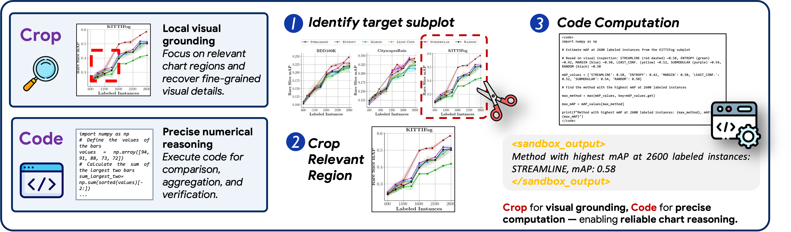

# CharTool: Tool-Integrated Visual Reasoning for Chart Understanding

<p align="center">
  <a href="https://arxiv.org/abs/2604.02794"></a>
  <a href="https://github.com/OpenDFM/CharTool"></a>
  <a href="https://huggingface.co/OpenDFM/CharTool-3B"></a>
  <a href="https://huggingface.co/OpenDFM/CharTool-7B"></a>
  
</p>

<p align="center">
  
</p>


## 📑 Table of Contents

- [Introduction](#introduction)
- [Released Resources](#released-resources)
- [Environment Setup](#environment-setup)
- [Training Pipeline](#training-pipeline)
- [Evaluation](#evaluation)
- [Citation](#citation)
- [Acknowledgement](#acknowledgement)

## 📖 Introduction

Charts encode dense visual structures and numerical relationships, making chart understanding challenging for multimodal large language models. **CharTool** addresses this problem by combining two complementary components:

- **DuoChart**, a scalable dual-source data pipeline that combines code-generated charts with real-world charts collected from scientific papers. The resulting training data provides both controllable numerical annotations and realistic visual diversity.
- **Tool-integrated chart reasoning**, which enables a multimodal model to use image cropping for localized visual perception and code execution for precise numerical computation.

CharTool is trained in two stages: cold-start supervised fine-tuning on tool-use trajectories, followed by agentic reinforcement learning on DuoChart. We develop **CharTool-3B** and **CharTool-7B** based on Qwen2.5-VL. Across six chart benchmarks, CharTool consistently improves over its corresponding base models and also generalizes to out-of-domain visual mathematical reasoning tasks. See our [paper](https://arxiv.org/abs/2604.02794) for details.

## 🚀 Released Resources

| Resource | Description | Status |
| --- | --- | --- |
| [CharTool-3B](https://huggingface.co/OpenDFM/CharTool-3B) | 3B tool-integrated chart reasoning model on Hugging Face | Available |
| [CharTool-7B](https://huggingface.co/OpenDFM/CharTool-7B) | 7B tool-integrated chart reasoning model on Hugging Face | Available |
| DuoChart | Dual-source chart reasoning dataset on Hugging Face | Coming soon |

The Hugging Face link for DuoChart will be added when the dataset is released.

## 🛠️ Environment Setup

We use [SWIFT](https://github.com/modelscope/ms-swift) for supervised fine-tuning (SFT) and [VeRL](https://github.com/volcengine/verl) for reinforcement learning (RL). The following Docker images reproduce the environments used in this project:

| Stage | Docker image | Key versions |
| --- | --- | --- |
| SFT | [ModelScope SWIFT 3.10.3](https://swift.readthedocs.io/en/v3.10/GetStarted/SWIFT-installation.html#mirror) | Ubuntu 22.04, CUDA 12.8.1, Python 3.11, PyTorch 2.8.0, vLLM 0.11.0, ModelScope 1.31.0, SWIFT 3.10.3 |
| RL / Evaluation | [VeRL 0.5](https://hub.docker.com/layers/verlai/verl/app-verl0.5-transformers4.55.4-vllm0.10.0-mcore0.13.0-te2.2/images/sha256-8ec276d967e6cbfa307eed9206ebb7d5197c770c1436e6153a2f9e6fc7b487c8) | VeRL 0.5, Transformers 4.55.4, vLLM 0.10.0, Megatron Core 0.13.0, Transformer Engine 2.2 |

Run the following commands from the repository root so that `$PWD` is mounted to `/workspace/CharTool` inside each container.

### SWIFT Container (SFT)

```bash
docker pull modelscope-registry.cn-hangzhou.cr.aliyuncs.com/modelscope-repo/modelscope:ubuntu22.04-cuda12.8.1-py311-torch2.8.0-vllm0.11.0-modelscope1.31.0-swift3.10.3

docker run -d \
    --runtime=nvidia \
    --gpus all \
    --network=host \
    --ipc=host \
    --name chartool-swift \
    --volume "$PWD":/workspace/CharTool \
    --workdir /workspace/CharTool \
    modelscope-registry.cn-hangzhou.cr.aliyuncs.com/modelscope-repo/modelscope:ubuntu22.04-cuda12.8.1-py311-torch2.8.0-vllm0.11.0-modelscope1.31.0-swift3.10.3 \
    sleep infinity

docker exec -it chartool-swift bash
```

### VeRL Container (RL and Evaluation)

```bash
docker pull verlai/verl:app-verl0.5-transformers4.55.4-vllm0.10.0-mcore0.13.0-te2.2

docker run -d \
    --runtime=nvidia \
    --gpus all \
    --network=host \
    --shm-size=10g \
    --cap-add=SYS_ADMIN \
    --name chartool-verl \
    --volume "$PWD":/workspace/CharTool \
    --workdir /workspace/CharTool \
    verlai/verl:app-verl0.5-transformers4.55.4-vllm0.10.0-mcore0.13.0-te2.2 \
    sleep infinity

docker exec -it chartool-verl bash
```

## 🔥 Training Pipeline

### Stage 1: Cold-Start SFT

The following example uses **Qwen2.5-VL-3B-Instruct** and requires at least 8 GPUs (1 node × 8 GPUs).

Enter the SWIFT Docker container and run:

```bash
docker exec -it chartool-swift bash
bash swift_scripts/train_chartool_3b.sh
```

### Stage 2: Reinforcement Training

RL training requires at least 9 GPUs (1 node × 8 GPUs for training and 1 GPU for the LLM judge), a code sandbox, and a judge model.

1. Install the required dependencies inside the VeRL Docker container:

   ```bash
   pip install transformers==4.57.6 sandbox-fusion qwen-vl-utils==0.0.14
   ```

2. Launch the judge model in a separate terminal or background process:

   ```bash
   vllm serve opencompass/CompassVerifier-7B \
       --tensor-parallel-size 1 \
       --max-model-len 32768 \
       --gpu-memory-utilization 0.8
   ```

3. Deploy the code sandbox:

   ```bash
   docker run -it -p 8080:8080 volcengine/sandbox-fusion:server-20250609
   ```

4. Configure the service endpoints. Export the OpenAI-compatible judge endpoint:

   ```bash
   export LLM_AS_A_JUDGE_BASE="http://<judge-host>:<port>/v1"
   ```

   Set `sandbox_fusion_url` in [`recipe/chartool/configs/sandbox_fusion_tool_config.yaml`](recipe/chartool/configs/sandbox_fusion_tool_config.yaml) to the endpoint of your deployed Sandbox Fusion service.

5. Start RL training after both services are ready:

   ```bash
   bash recipe/chartool/run_qwen2.5_vl_3b.sh
   ```

## 📊 Evaluation

Taking [**CharXiv**](https://github.com/princeton-nlp/CharXiv) as an example, we provide scripts for evaluating CharTool.

The evaluation scripts have been tested in the VeRL Docker container described in [Environment Setup](#environment-setup).

### 1. Data Preparation

From the repository root, download and extract the evaluation images:

```bash
cd eval/images
wget https://huggingface.co/datasets/princeton-nlp/CharXiv/resolve/main/images.zip
unzip images.zip && rm images.zip
```

### 2. Inference and Scoring

Run the following commands from the `eval` directory. The `--mode` argument accepts either `descriptive` or `reasoning`.

Before generating responses, deploy [Sandbox Fusion](https://github.com/bytedance/SandboxFusion) and set its endpoint via the `SANDBOX_ENDPOINT` environment variable:

```bash
export SANDBOX_ENDPOINT="http://<sandbox-host>:<port>"
```

#### Generate Responses

```bash
python src/generate.py \
    --model_name chartool \
    --split val \
    --mode <descriptive|reasoning> \
    --model_path <path_to_your_model>
```

#### Evaluate Responses

```bash
python src/evaluate.py \
    --model_name chartool \
    --split val \
    --mode <descriptive|reasoning> \
    --api_key <your_openai_key>
```

#### Calculate Statistics

```bash
python src/get_stats.py \
    --model_name chartool \
    --split val
```

## 📝 Citation

If you find CharTool or DuoChart useful in your research, please cite our paper:

```bibtex
@article{zhang2026chartool,
  title   = {CharTool: Tool-Integrated Visual Reasoning for Chart Understanding},
  author  = {Zhang, Situo and Zhang, Yifan and Zhu, Zichen and Ma, Da and Pan, Lei and Zhang, Danyang and Zhao, Zihan and Chen, Lu and Yu, Kai},
  journal = {arXiv preprint arXiv:2604.02794},
  year    = {2026}
}
```

## 🙏 Acknowledgement

CharTool is built with several excellent open-source projects, including [SWIFT](https://github.com/modelscope/ms-swift), [VeRL](https://github.com/volcengine/verl), [vLLM](https://github.com/vllm-project/vllm), and [Sandbox Fusion](https://github.com/bytedance/SandboxFusion). We also thank the maintainers of [CharXiv](https://github.com/princeton-nlp/CharXiv) and [CompassVerifier](https://huggingface.co/opencompass/CompassVerifier-7B) for making their resources publicly available.
